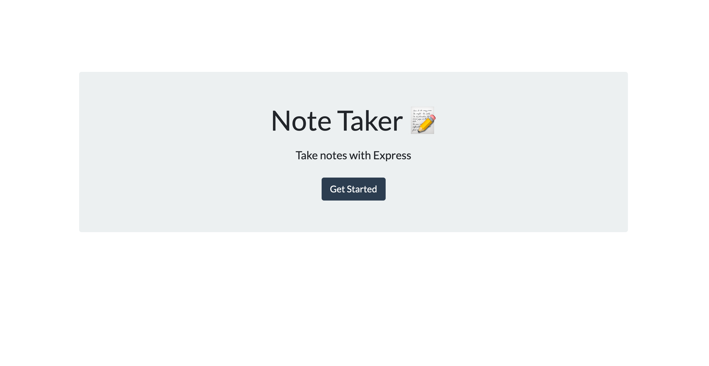
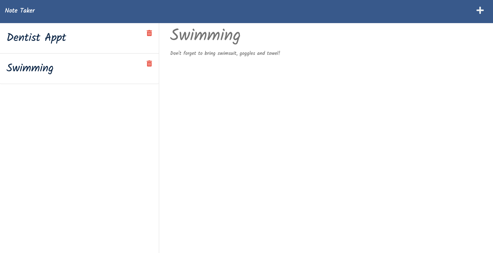
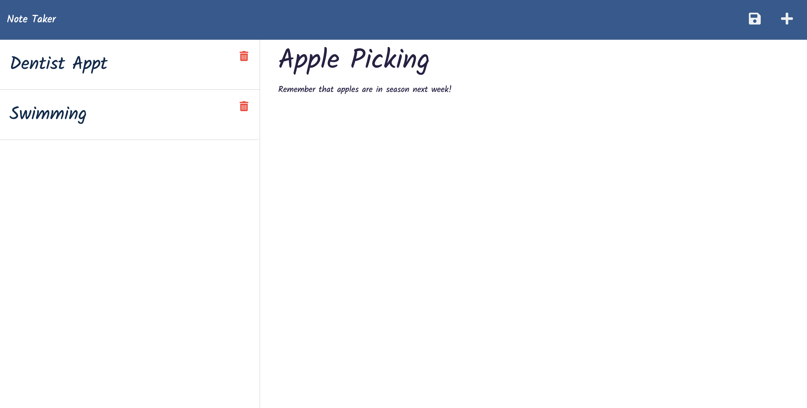

# Jessica Chen - Note Taker

## Columbia University Bootcamp - Express.js Challenge: Note Taker

> This repository contains my Note Taker application that allows an end user to write and save notes.
> Link to Live Application: https://intense-basin-30999.herokuapp.com/

## Table of Contents

- [General Info](#general-information)
- [Project Requirements](#project-requirements)
- [Screenshots](#screenshots)
- [Source Code](#source-code)
- [Contact](#contact)

## General Information

This repository contains the code for my command line application that prompts the end user with a series of questions about their team members and their information to generate a HTML page with a formatted team roster with quick access to members' emails and GitHub profiles.

## Project Requirements

User Story:

```
AS A small business owner
I WANT to be able to write and save notes
SO THAT I can organize my thoughts and keep track of tasks I need to complete
```

Acceptance Criteria:

```
GIVEN a note-taking application
WHEN I open the Note Taker
THEN I am presented with a landing page with a link to a notes page

WHEN I click on the link to the notes page
THEN I am presented with a page with existing notes listed in the left-hand column, plus empty fields to enter a new note title and the note’s text in the right-hand column

WHEN I enter a new note title and the note’s text
THEN a Save icon appears in the navigation at the top of the page

WHEN I click on the Save icon
THEN the new note I have entered is saved and appears in the left-hand column with the other existing notes

WHEN I click on an existing note in the list in the left-hand column
THEN that note appears in the right-hand column

WHEN I click on the Write icon in the navigation at the top of the page
THEN I am presented with empty fields to enter a new note title and the note’s text in the right-hand column
```

## Screenshots





## Source Code

Source Code Reference: https://github.com/coding-boot-camp/miniature-eureka

## Contact

Created by: Jessica Chen | jessicachen28@gmail.com
